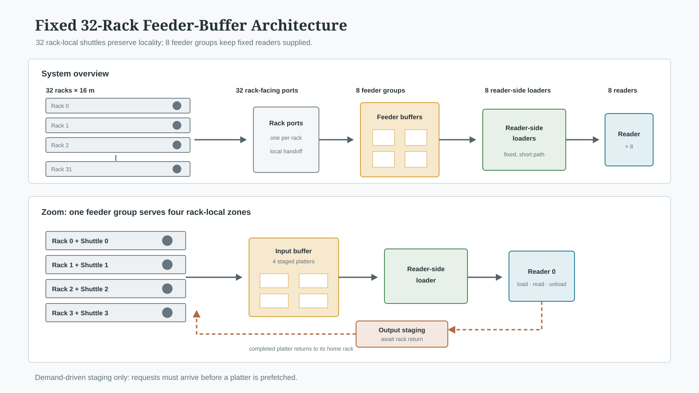

# Fixed 32-Rack Feeder-Buffer Pilot

The pilot fixes 32 racks at 16 m, 32 rack-side shuttles, 8 readers, and one fixed reader-side loading mechanism per reader. Four rack-local zones feed each reader group through a four-slot input buffer. Completed platters wait in output staging until a rack shuttle returns them home.

The request flow is `home slot → rack shuttle → rack-facing port → input buffer → reader-side loader → reader → output staging → rack shuttle → home slot`. Staging is demand-driven: only requests that have already arrived may trigger a fetch, and requests mapped to the same available platter merge at dispatch.

The first experiment compares three architectures on the same rack layout, reader count, trace, and platter placement:

- Static Zone uses 8 end-to-end shuttles, each owning four racks, without feeder buffers.
- Rack-local Zone keeps one shuttle on each rack and treats dedicated rack movement as conflict-free.
- Shared No-Zone lets all 32 rack shuttles cross racks; direct paths wait behind earlier space-time reservations.

The rack layout, reader count, trace, and platter placement are paired. Shuttle count and buffering differ between Static and the buffered architectures, so this is not a pure scheduling-policy ablation.

Assumptions: input buffers have four slots per reader; waiting outside a full buffer is an optimistic off-rail hold; output staging applies return-priority backpressure at 32 waiting platters; reader-side loader travel is represented by serialized reader load/unload time rather than explicit geometry.
