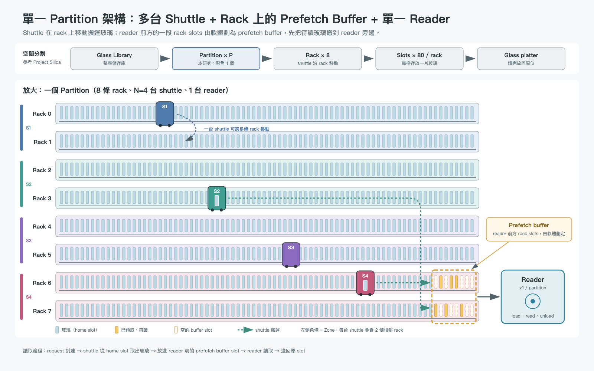

# 讓玻璃持續送達 Reader：Partition 內搬運、協作與預取的研究故事

研究敘事工作稿｜2026-10-03｜依據目前專案模擬與討論整理

> **核心主線：不是讓 shuttle 一直忙，而是讓 reader 持續有玻璃可讀。**
>
> 本文將「已跑出的觀察」「尚待驗證的解釋」「接下來的方法規劃」分開呈現。預期效果是研究假設，不是事先保證的結果。

### 閱讀導覽

- **背景與架構**：第 1–4 節，先了解一片玻璃如何被讀取。
- **三段核心故事**：第 5–7 節，說明多 shuttle、協作方式與 prefetch buffer 為何存在。
- **設定與研究規劃**：第 8–10 節，釐清參數、方法、預期效果與驗證順序。
- **論文與報告敘事**：第 11–13 節，整理可直接講述的故事與證據邊界。

## 1. 先用一句話說明我們在研究什麼

我們研究的是：在一個玻璃儲存 partition 內，如何讓多臺 shuttle 在有限的路徑與暫存空間下協作，持續把已知需要讀取的玻璃送到同一臺 reader，減少 reader 因等待玻璃而閒置的時間。

這不是三個互不相關的題目，而是一個供料問題的三個層次。第一層是「搬運能力夠不夠」，因此需要討論 shuttle 數量；第二層是「搬運能力能不能有效使用」，因此需要討論 Zone 與 Non-Zone 的協作；第三層是「搬運完成的時間能不能接上讀取時間」，因此需要討論 Feeder Buffer，也就是已知請求的 prefetch buffer。

目前我們已有模擬觀察與研究方向，還沒有完成並驗證最終的新演算法。本文因此是一份把背景、架構、證據與待驗證方法串起來的研究故事，不是宣稱所有貢獻已成立的完成版論文。

## 2. 背景：資料存在玻璃上，但 Reader 不會自己走到資料面前

在本文的系統模型中，玻璃放在 rack 的儲存位置，reader 位於 partition 內的固定位置。當讀取請求到達，系統必須找到對應玻璃，由 shuttle 移動到該位置、取出玻璃，再送到 reader 附近。玻璃完成交付與裝載後，reader 才能執行讀取。

所以一次服務不是只有「讀取 8 秒」，而是包括等待派工、搬運、路徑等待、交付、裝載、讀取與卸載。即使 reader 的光學讀取能力很好，只要玻璃尚未送到，它仍然無法工作。整個研究的起點，是讀取裝置與搬運裝置之間的供需不匹配。

這裡不應把傳統儲存簡化成「完全不需要考慮距離」。硬碟會考慮尋道與旋轉延遲，磁帶系統與自動倉儲也有實體搬運問題。我們真正要處理的差異，是本架構把玻璃搬運、共享路徑、交付與光學讀取分配給不同資源；這些資源可以重疊工作，也可能彼此阻塞。未來要稱為 glass-aware，還需要用玻璃的實際尺寸、搬運與交付條件、讀取粒度和時間去校準，而不是只把一般倉儲排程換一個名稱。

## 3. 架構：一個實體 Partition，一臺 Reader，多臺 Shuttle

整個儲存系統可以有多個 partition，但本文先固定研究一個 partition。每個 partition 是一個實際儲存區塊，內有 rack、可移動的 shuttle、一臺 reader，以及 reader 附近有限容量的待讀位置。

| 元件或機制 | 明確用途 | 不負責什麼 |
| --- | --- | --- |
| Rack 與玻璃位置 | 儲存玻璃，決定取件的位置與距離 | 不會主動把玻璃送到 reader |
| 多臺 Shuttle | 平行取件、交付並執行固定的放回流程 | 不能增加單臺 reader 的讀取速度 |
| Zone／Non-Zone 協作 | 決定哪些 shuttle 能服務哪些位置，以及如何共享搬運資源 | 不是新增 reader，也不保證完全沒有交通衝突 |
| Feeder／Prefetch Buffer | 暫存已交付的待讀玻璃，使交付與讀取解耦 | 不是無限容量，也不是儲存熱門資料的長期 cache |

Zone 與 Non-Zone 是同一套硬體上的執行方式，而不是各自獨立的新硬體元件。這讓論文更容易收斂：我們設計的是一套供料架構及其控制方法，而不是強行找出三種全新的硬體。

圖說：圖中 N=4 用於說明多 shuttle 與 Zone 的關係，不代表所有實驗都使用 4 臺。這是概念示意，非等比例物理佈局。圖示的 rack 待讀位置與目前模擬的 reader 端抽象 buffer 並不完全相同，不能據此宣稱實體交付機構已驗證，或不需任何額外硬體成本。

## 4. 從一筆請求走完整個流程

假設 reader 正在讀取玻璃 A，而 B、C、D 的請求也已到達。控制器知道這些請求的位置，並把 B、C、D 分配給可用 shuttle。各 shuttle 預約可通行的路段，到 rack 取件，沿可用路徑把玻璃帶到 reader 端。

沒有 buffer 時，完成取件的 shuttle 可能必須等 reader 接收，才能釋放交付中的任務。若 reader 尚未讀完 A，這些 shuttle 即使已完成主要搬運，也可能無法立即去服務後續請求。

有 buffer 時，只要待讀位置與交付資源可用，shuttle 就能先交付 B 或 C，再離開去做下一項工作。reader 完成 A 後，若待讀玻璃已在近端，就能較快接上下一次讀取。當 reader 處理前面的玻璃，shuttle 同時搬運後面的玻璃，兩者形成 pipeline，也就是流水式的重疊工作。

玻璃讀完後仍須卸載與放回。現有模型包含固定的放回工作與有限輸出空間，不能說放回成本完全不存在；但放回策略本身暫時不是本文要擴張研究的第四個主題。

## 5. 第一段故事：為什麼不能只用一臺 Shuttle？

若只有一臺 shuttle，它需要在各儲存位置與 reader 之間移動。當它去取下一片玻璃時，reader 可能已完成上一片，只能等待。這時增加 reader 速度不一定有效，因為瓶頸是供料不足。

多臺 shuttle 的作用是同時準備不同請求，增加供料能力。它們不會自動縮短單一玻璃的幾何路徑，也不是把一次搬運切成多人共同搬運；它們主要縮短的是整批請求中原本序列發生的供料間隔。

一個直覺估算，是把單 shuttle 的服務間隔除以 reader 的服務週期。現有 32 m、B=4 的配置中，單 shuttle 實測的平均完成間隔約 65.7 秒，reader 的裝載、讀取與卸載週期是 2+8+1=11 秒，比例約為 6。這只是忽略資源互相影響的粗估，不是「六臺一定足夠」的證明；65.7 秒也不是純粹行駛時間。

### 5.1 如何用目前的資料解釋 Shuttle 數量

目前必須區分兩組設定，不能把不同配置接成同一條曲線。

| Shuttle 數量 N | 16 m、B=8、固定讓行代價 3 s 的 Reader utilization |
| --- | --- |
| 1 | 22.0% |
| 2 | 37.6% |
| 4 | 59.7% |
| 8 | 86.9% |
| 16 | 99.2% |
| 32 | 98.8% |

這組觀察來自 results/partition-shuttle-provisioning-n32。它支援「從一臺增加到多臺，可以大幅降低供料不足」，但不支援「八臺是利用率最高」。如果設計門檻定為 90%，這組資料中最小達標點是 16 臺；門檻本身仍是設計選擇。

目前另一組 32 m、B=4、沒有上述 3 s 讓行代價的資料，N=1、2、4、8 的 reader utilization 約為 16.8%、30.4%、52.9%、80.0%。這組資料來自 results/partition-shuttle-provisioning，同樣顯示增加 shuttle 能改善供料，但具體需求臺數隨配置而改變。

報告時可以說：「我們先確認多 shuttle 的必要性，再用利用率與增量收益選擇一個合理工作點；八臺可以是研究配置，不應預先宣稱它必然是全域最佳配置。」

### 5.2 太多 Shuttle 會不會反而不好？

可能，但需要有物理或模型依據。若 shuttle 共享狹窄路徑、交付入口或停等位置，增加 shuttle 可能增加讓行、阻塞與佔道時間。不過，即使交通等待增加，reader utilization 也可能只達到平臺，而不是一定下降。安全排程、停車空間與入口准入控制方式都會影響結果。

最新 results/partition-shuttle-congestion 加入「受阻會延長路段佔用」的示意模型，在 0.9 秒佔用延長參數下，峰值落在 N=8，reader utilization 約 59.7%。但結果檔明確記錄：0.9 秒是看到結果後選擇、用來展示八臺峰值的情境；0.8 秒峰值在九臺，0.5 秒在十二臺，1.0 秒在七臺。這不能當成八臺最佳的獨立證據。

目前可以保留的結論是「若擁擠降低交通系統有效容量，可能存在有限的最佳臺數」。最佳臺數與碰撞代價仍須由可驗證的幾何、機器人行為或實測校準。模擬中的路段預約衝突是安全交通等待的代理量，不是實際撞擊次數。

## 6. 第二段故事：有多臺 Shuttle，為什麼還需要協作設計？

有了多臺 shuttle，不代表每一臺都能有效工作。接下來的問題是：哪些 shuttle 能服務哪些玻璃？是否為了減少相互幹擾而限制它們的服務範圍？

### 6.1 Zone：用明確的責任範圍換取簡單與局部性

Zone 把同一個 partition 的 rack 位置分給不同 shuttle。每臺主要負責自己的區域，控制器比較容易判斷應由誰處理請求，移動範圍也較有規律。這能減少部分跨區移動與派工選擇，但所有 shuttle 仍可能在 reader 入口相遇，所以 Zone 不等於完全消除碰撞或排隊。

當請求在各區相對平均時，固定分工可能有效。但當大量請求集中在一個區域，負責該區的 shuttle 可能忙不過來，其他區的 shuttle 卻無法幫忙。這不是單純「總臺數不夠」，而是可用能力被責任邊界隔離。

### 6.2 Non-Zone：用可共享的能力換取協調成本

Non-Zone 允許可用 shuttle 服務 partition 內不同位置。熱區可以獲得其他 shuttle 支援，但需要決定派工物件、路段使用時機，以及何時進入共同交付區。若只依請求順序派工，而不考慮距離與資源佔用，新增彈性可能被長距離移動與交通等待吃掉。

這裡的 FIFO 是 First-In, First-Out，先進先出的基礎派工規則；lookahead 則是檢視已到達請求中的一段候選視窗，考慮較合適的取件次序。它不是預測尚未到達的請求，也不等於 reader 必須嚴格照原始請求順序讀取。現有模型的待讀順序主要依交付到達順序，這個語意在後續方法中必須明確固定。

### 6.3 資料如何支撐這一段故事

在 results/partition-feeder-story 的同一個 32 m、N=4、B=4、讀取 8 秒配置中，平均分佈請求下，Zone 約完成 3.204 requests/min，Non-Zone FIFO 約為 2.885；但熱區請求下，Zone 約為 1.225，Non-Zone FIFO 約為 2.206。

這裡使用每分鐘完成請求數，是為了對比協作方式，不是取代 shuttle 配置頁面應聚焦的 reader utilization。兩個情境一起看，重點是「固定分區與共享存在取捨」，而不是哪一個方法全面比較好。平均負載有利於區域性分工，熱區負載則讓能力共享更有價值。

因此故事自然走向：我們不想只有完全固定與完全共享兩個極端，而希望在保留局部性的同時，必要時借用空閒能力。這是方法方向，目前還不是經驗證的新結果。

## 7. 第三段故事：即使能取到玻璃，為什麼還需要 Prefetch Buffer？

Zone 或 Non-Zone 決定誰去取件，但沒有解決「取件完成時間不一定剛好接上 reader」的問題。多臺 shuttle 可能同時到達 reader，也可能在 reader 完成後仍有下一片玻璃尚未到達。前者使 shuttle 等交付，後者使 reader 等供料。

Prefetch buffer 是有限的、靠近 reader 的實體待讀位置。它讓已知未來要處理的玻璃先被交付，使 reader 消耗暫存的玻璃時，shuttle 可以繼續準備後續工作。它解決的是時間解耦，不是把所有遠端搬運變成近端搬運。

使用者提出的「提前準備前 N 筆，N 等於 partition 的 shuttle 數量」是合理的控制方向。但 buffer 容量 B=N 與「嚴格只允許接下來 N 筆請求預取」不是同一件事。現有模擬有有限待讀容量，卻沒有完整實作這個嚴格視窗限制；不能把現有容量掃描稱為 next-N 政策已被驗證。

### 7.1 固定 N=8，比較 B=0、8、16

以下使用 results/partition-feeder-prefetch-n8 的 32 m、8 rack、每 rack 80 個地址、8 秒讀取場景。這批資料沒有前述 3 秒讓行代價，也沒有 0.9 秒佔用延長。表內為五個 seeds 的平均值。

| 平均分佈、Zone | B=0 | B=8 | B=16 |
| --- | --- | --- | --- |
| 每分鐘完成請求數 | 4.432 | 4.879 | 4.902 |
| 第 99 百分位回應時間，分鐘 | 84.14 | 76.29 | 75.32 |
| 讀取開始前已完成交付的比例 | 0% | 95.4% | 96.7% |

這組資料支援 buffer 在此情境中改善供料重疊，而且從八個增加到十六個位置，收益已變小。B=8 相對 B=0 的完成速率增加約 10.1%，第 99 百分位回應時間下降約 9.3%。可以用這個結果說明解耦有價值，但不應說 buffer 消除了整段搬運，或所有場景都會大幅加速。

| 熱區分佈、Non-Zone FIFO | B=0 | B=8 | B=16 |
| --- | --- | --- | --- |
| 每分鐘完成請求數 | 2.895 | 2.719 | 2.719 |
| 第 99 百分位回應時間，分鐘 | 131.21 | 139.25 | 139.25 |

這個反例同樣重要：buffer 不是免費加速器。現有基礎策略與共享路徑下，更積極的搬運可能改變交通與交付時序，最後總體表現反而變差。不過這只是與結果相容的機制解釋，若要確定原因，還需要分解路段佔用、入口等待與 reader 缺料事件。

熱區 Zone 的 B=0 到 B=8，也只從約 2.172 提高到 2.242 requests/min。這提醒我們：若熱區的搬運能力本來就不足，增加待讀位置無法創造供料能力。Buffer 與協作方法必須一起看。

### 7.2 為什麼不能只看 Buffer 命中率？

現有「預取命中」指該片玻璃在它實際讀取開始前已完成交付，不是 cache 重複命中，也不是相對某個固定期限已準時供料的比例。玻璃在 buffer 裡等很久，仍可能被算為命中。因此高命中率不能單獨證明 reader 沒有缺料，也不能證明等待時間大幅下降。

預取提前量也不是省下的時間。提前 80 秒可能代表成功重疊，也可能代表玻璃過早佔住有限空間。有效證據仍應回到 reader 缺料時間、完成速率、尾端延遲，以及 shuttle 被阻塞的位置。

## 8. 目前參數代表什麼，不代表什麼？

目前架構固定為一個 partition、8 個 rack 儲存列，每列 80 個玻璃地址，共 640 個地址。這是模擬容量，不是實測機櫃規格。16 m 除以 80 對應約 0.2 m 的地址間距，32 m 則約 0.4 m；真正能否存放這些玻璃，還取決於玻璃尺寸、保護結構、取放空間與安全距離。

不能只因為某個長度使 N=8 看起來漂亮，就說該長度最合理。16 m 與 32 m 可以作為敏感度情境，但主要故事必須選定並標清一組設定，其他設定另列對照。此稿保留兩組 provisioning 的差異；協作與 buffer 的主要觀察使用 32 m。

| 專案 | 本文主要觀察的設定或定義 |
| --- | --- |
| 讀取服務 | 裝載 2 s、光學讀取 8 s、卸載 1 s |
| 搬運速度模型 | 速度 2 m/s、加速度 2 m/s²，仍待實機校準 |
| 工作量 | 多數主要實驗為 384 筆已到達的批次請求 |
| 請求位置 | 平均分佈，或 75% 指向前兩列的熱區分佈 |
| 重複取件 | 同一玻璃尚未放回時，不能同時再次取出 |
| 統計 | 五個 seeds；重複抽樣合成請求，不代表五套實測機櫃 |

384 筆請求不等於儲存了 384 片不同玻璃，也不代表 640 個地址全部被讀遍。批次中所有請求同時到達，後面的請求自然等待很久。僅 reader 的理想序列服務下，384×11 秒已是 70.4 分鐘，因此圖中幾十分鐘甚至更長的尾端回應時間，是整批排隊的結果，不是每片玻璃純搬運要那麼久。

Reader utilization 在目前模型中包含裝載、讀取與卸載忙碌時間，分母是有限批次的觀測區間；它不是只有光學讀取佔比，也不是無限時間的穩態利用率。圖中若以五次實驗的標準差畫上下誤差棒，那是樣本間離散程度，不是自動成立的 95% 信賴區間。

## 9. 從觀察走向方法：現在最值得收斂的設計方向

我們不需要立即加入更多元件。最值得保留的一條方法主線是：以 reader 的供料需求為中心，聯合決定取件對象、shuttle 使用與 buffer 准入控制。

第一個基礎是保持局部性。平常優先由近端或原責任區的 shuttle 處理，避免完全共享造成不必要的跨區移動。第二個基礎是有限借援。當某區請求累積，而其他 shuttle 空閒時，才允許借援，並把預估路徑佔用與到達時間算進去。第三個基礎是 buffer credit，也就是交付前必須取得有限待讀容量的准入控制額度，避免所有 shuttle 同時向入口推送。

這三個決策可以使用簡單資料結構表示：已知請求佇列記錄地址與等待時間，shuttle 狀態表記錄位置與可用時間，路段預約表記錄佔用區間，buffer credit 表記錄可接收位置。資料結構不是論文貢獻本身；貢獻應是這些狀態如何形成可解釋的決策規則，並改善現有固定分區或完全共享的失敗情境。

可考慮以「預估何時完成交付、reader 何時需要玻璃、此任務會佔用哪些共享資源」來評估候選，而不是只使用 FIFO，或只選距離最近的一片。同時加入等待時間上限，避免遠端請求長期被近端請求跳過。這是待實作的方向，不是本文已有資料的 proposed method。

### 9.1 我們預期改善什麼？什麼情況可能不會改善？

我們預期的不是「每一片玻璃的搬運距離都縮短」，而是讓搬運完成的時間更接近 reader 的需求時間。若改善成立，reader 等待下一片玻璃的空檔應減少，shuttle 帶著玻璃等待交付的時間也應降低；完成速率與尾端延遲則用來確認局部改善是否真的轉化為整體收益。

| 設計方向 | 預期效果，仍待驗證 | 可能失效的情境 |
| --- | --- | --- |
| 多 shuttle 平行供料 | 降低單 shuttle 供料不足造成的 reader 閒置 | Reader 已飽和，或共享路徑成為瓶頸 |
| 保留局部性、有限借援 | 熱區獲得空閒能力，不必全面增加跨區移動 | 借援距離與交通成本超過負載平衡收益 |
| 有限 buffer 與准入控制 | 提前備料，減少交付阻塞與無效堆積 | 供料能力不足，或准入控制過度保守 |
| 聯合協調 | 避免派工與預取各自最佳、合起來反而擁擠 | 狀態估計不準，或控制成本高於收益 |

目前不設定「一定提升多少百分比」的承諾，也不要求曲線必須在 N=8 出現峰值。如果方法沒有改善，應回頭檢查供料不足、交通阻塞與 buffer 占用何者才是真正瓶頸，而不是改參數直到出現想要的結果。

### 9.2 實作順序與每一步的交付內容

第一步先鎖定一份主配置，明確列出 rack 長度、640 個地址的位置、搬運速度、reader 週期、交付與放回規則。16 m 或 32 m 應在幾何假設確認後選定，不能混用。交付內容是一份配置表與基礎方法說明，而不是立即產生更多圖。

第二步只重現 shuttle 數量對 reader utilization 的影響。主圖使用 N=1、2、4、8、16、32，其他參數固定。交付內容是一張利用率曲線、變異範圍與所選工作點的理由；工作點可以考慮成本與收益，不等同於最高利用率點。

第三步固定工作點，比較 Zone 與 Non-Zone FIFO 在平均與熱區請求下的差異，再固定 N=8 比較 B=0、8、16。這一步要確認基礎方法失效在哪裡，交付內容是少量對照圖與等待時間分解。

第四步才實作有限借援與 buffer 准入控制，並以相同請求序列做消融比較。若要使用「前 N 筆」的概念，必須另外定義窗口如何前進、何時保留位置、是否允許重排，以及如何避免飢餓。交付內容是可重現的方法、消融結果與有效範圍，不是預先寫好的成功結論。

以上是接下來的規劃，本文這次只整理故事與既有證據，沒有執行這些新實驗。

## 10. 最小但足夠的後續實驗

先不要追求每張圖都證明方法有效，而是讓每一組實驗只回答一個問題，並對應到故事的一個轉折。

| 實驗 | 控制與比較 | 要回答的問題 |
| --- | --- | --- |
| 搬運能力 | 固定 rack、reader 與 B，比較 N=1、2、4、8、16、32 | 多臺是否必要？收益何時變小？ |
| 協作邊界 | 固定 N 與 B，比較 Zone、Non-Zone FIFO、有限借援 | 平均與熱區負載下，責任邊界如何影響供料？ |
| 時間解耦 | 固定 N=8，比較 B=0、8、16 | Buffer 是否降低 reader 缺料？瓶頸是否轉移？ |
| 方法拆解 | 基礎方法、只借援、只准入控制、兩者合併 | 改善到底來自哪個設計，而不是更多資源？ |

主要配置應統一，安全路段預約、交付資源、放回成本與請求序列保持一致。若加入固定 3 秒讓行代價，要清楚解釋事件觸發規則；若加入佔用延長模型，要報告參數依據與敏感度，不能用挑出的峰值證明最佳臺數。

Shuttle 配置的主圖只保留 reader utilization，符合當前收斂目標。解釋機制時，另外統計 reader 缺料時間、shuttle 等待交付時間與交通阻塞時間即可，不必把全部指標擠在一頁。之後才用完成速率與尾端延遲評估完整方法。

還需要至少補一組線上到達實驗，用接近但不超過實際系統容量的負載驗證，而不是只看所有請求同時到達的批次。實際容量應從該配置估計，不能直接以單 reader 的理論處理能力當作整個搬運系統容量。

## 11. 如果把它寫成論文，故事應怎樣推進？

開頭先說清楚：玻璃儲存的讀取不僅取決於 reader 本身，也取決於玻璃是否能及時送到。在包含多個搬運資源的 partition 中，擴充資源數量、決定協作範圍，以及設定近端待讀位置，都會改變供料過程。

接著給出三個觀察。第一，多 shuttle 可緩解單 shuttle 的供料限制，但數量收益受讀寫時序與交通能力影響。第二，固定分區保留局部性，卻可能在熱區閒置可用資源；完全共享釋放能力，卻可能增加共享路徑成本。第三，buffer 可以重疊搬運與讀取，但單純增加容量不能解決取件能力失衡，甚至可能與交通排程產生負面作用。

因此問題不是分別尋找三個最優開關，而是協調「並行能力、空間共享、時間解耦」。論文的方法隨後回答：如何在有限容量與安全交通約束下，讓玻璃在 reader 需要之前完成交付，同時避免無效的跨區搬運和入口堆積。

評估再依次驗證各層必要性、基礎策略侷限、方法改進與元件消融。最後明確說明有效範圍：若搬運本來就遠快於讀取，多 shuttle 和更大 buffer 的邊際效益可能很小；若熱區能力不足，buffer 不能獨立解決問題；若共享路徑極窄，借援可能得不償失。

對於 DAC／ICCAD 方向，本文尚需把物理資源約束、控制開銷、方法複雜度與可實現性講清楚。僅有一個更好的排隊規則和合成曲線，還不足以宣稱具備完整架構貢獻或投稿成熟度。無需先擴張更多主題，而應把現有三層之間的因果關係與實際約束做紮實。

## 12. 可以直接拿去講的整段口語故事

「我們的系統裡，玻璃不是放進 reader 後就一直在那裡。它們平常放在 rack 上，需要 shuttle 把對應的玻璃送過來。所以 reader 就算讀得很快，只要玻璃沒到，它還是必須等。

我們先問一個最基本的問題：一臺 shuttle 能不能餵飽一臺 reader？如果搬運比讀取久，它就可能來不及。因此我們用多臺 shuttle 同時準備不同玻璃，讓 reader 讀當前這一片時，其他機器已經在準備下一片。但增加機器不是無限有效，因為大家會共享路徑，也會到同一個 reader 入口。

接著，我們考慮如何讓這些機器合作。固定分區比較單純，每臺負責自己的範圍，也比較容易保持局部性。可是請求若集中在某一區，其他機器可能閒著卻不能幫忙。完全共享可以幫助熱區，但如果沒有好的排程，又可能造成額外移動和交通等待。所以我們想找到一個保留局部性、必要時又可以借援的方法。

最後，即使玻璃已經取到，也不代表 reader 現在就能接收。沒有待讀空間時，shuttle 可能帶著玻璃一直等。我們因此加入 reader 附近的 prefetch buffer，讓已知後續請求的玻璃提前交付。這樣 reader 和 shuttle 就能像流水線一樣重疊工作。

不過我們現在的實驗也提醒我們：buffer 不是越大越好，共享也不是永遠比較好。真正要做的，是把派工、協作與有限的待讀容量一起協調，讓 reader 持續有玻璃可讀，同時不要把擁擠問題轉移到入口。這就是目前論文的核心方向。」

## 13. 證據狀態與可追溯來源

目前已有證據支持的結論，是特定合成場景中多 shuttle 的供料改善、固定分區與共享的負載依賴取捨，以及 buffer 收益隨策略和負載改變。合理但仍待驗證的推論，是有限借援與 buffer 准入控制聯合設計可能改善這類取捨。尚未證明的主張，包括八臺在真實系統中最優、實際碰撞頻率、嚴格 next-N 策略的收益、以及某種新演算法優於全部基礎策略。

本文引用的是現有結果，沒有重跑模擬。主要實現為 glass_sim/partition_feeder_study.py；結果來源分別是 results/partition-shuttle-provisioning-n32、results/partition-shuttle-provisioning、results/partition-shuttle-congestion、results/partition-feeder-story 與 results/partition-feeder-prefetch-n8。實驗參數應以各目錄的 config、summary 與逐次結果記錄交叉核對，不以簡報標題替代證據。

現有路段模型以離散資源預約保證安全，不包含完整機器人外形、連續運動避障與真實入口幾何；交付停車位數量也是模型假設。Reader 近端 buffer 有抽象取放介面，不能直接等同於任意 rack 空位都能無成本供料。若模擬中加入佔用延長，其路段佔用時間也不應誤讀為純幾何行駛時間。

這份檔案的最終結論是：目前最穩固的研究主線不是「證明八臺最好」，而是「解釋並改善 reader 的供料問題」。多 shuttle 提供並行能力，協作策略決定這些能力能否共享，prefetch buffer 使搬運與讀取能夠錯峰重疊；後續方法的價值，必須體現在這三者之間的協調，而非只增加數量或容量。
