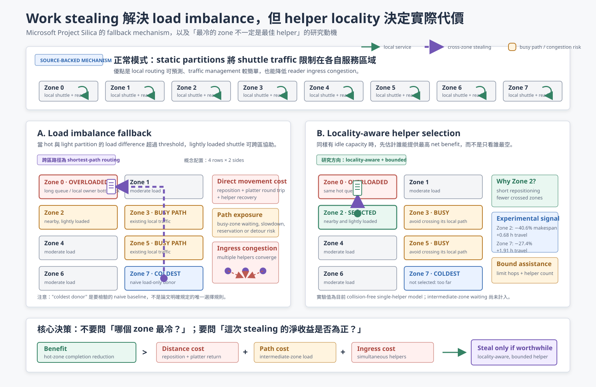

# Project Silica Work Stealing: Why the Coldest Zone May Not Be the Best Helper



## 怎麼讀這張圖

上方先說明 static partition 的原始價值：每台 shuttle 正常只在自己的 partition 服務，因此 local routing、traffic management 與 reader ingress 都較容易控制。

左下是 Project Silica 的 load-imbalance fallback。當 overloaded 與 lightly loaded partitions 的待讀資料量差異超過 threshold，lightly loaded shuttle 可以暫時跨區協助 hot partition。這重新利用原本 idle 的 shuttle-reader capacity，但 helper 必須承擔 repositioning、platter 往返與回復自己正常服務區域的成本。若路徑經過 busy zones，還可能增加 route conflict 或 waiting；多台 helpers 同時進入 hot zone，也可能造成 ingress congestion。

右下是研究 insight。Zone 7 即使是全系統最冷的 zone，也可能因距離太遠、跨越 zones 太多，而不如負載稍高但鄰近的 Zone 2。Donor selection 因此不應只比較 queue load，而應比較預期 completion-time benefit 與完整 assistance cost。

## Source fact 與研究假設

Project Silica 論文支持下列機制：controller 監控 partition load difference；lightly loaded partition 的 shuttle 可以進入 overloaded partition；跨 partition movement 使用 shortest-path routing，且可能增加 congestion。

「只按照 load 選全系統 coldest donor」是需要評估的 load-only baseline，不應描述成論文明確規定的唯一 donor-selection policy。論文也沒有完整公開 platter selection、helper reader assignment、同時 helper 數量與 path reservation 細節。

## 與目前實驗的連結

目前 collision-free single-helper experiment 中，Zone 2 helper 將 strong-hotspot makespan 降低 40.6%，增加 0.68 h aggregate travel；Zone 7 helper只降低 27.4%，卻增加 1.91 h aggregate travel。這支持 helper locality 會影響 direct movement cost，但尚未證明 intermediate-zone interference 或 multi-helper congestion。

研究問題可以收斂為：

> How should a static-zone glass library select and bound helpers so that hot-zone completion gains exceed cross-zone movement and congestion costs?

對應的簡化決策式：

```text
steal if:
expected hot-zone completion reduction
>
repositioning + platter round trip
+ intermediate-zone interference
+ hot-zone ingress congestion
```

## 相關資料

- [Static-zone hotspot and work-stealing note](static-zone-hotspot-work-stealing.md)
- [Project Silica SOSP 2023](../references/ProjectSilica-SOSP23.pdf)
- [Current work-stealing experiment](../../results/static-zone-work-stealing-study/STATIC_ZONE_WORK_STEALING_MOTIVATION.md)
