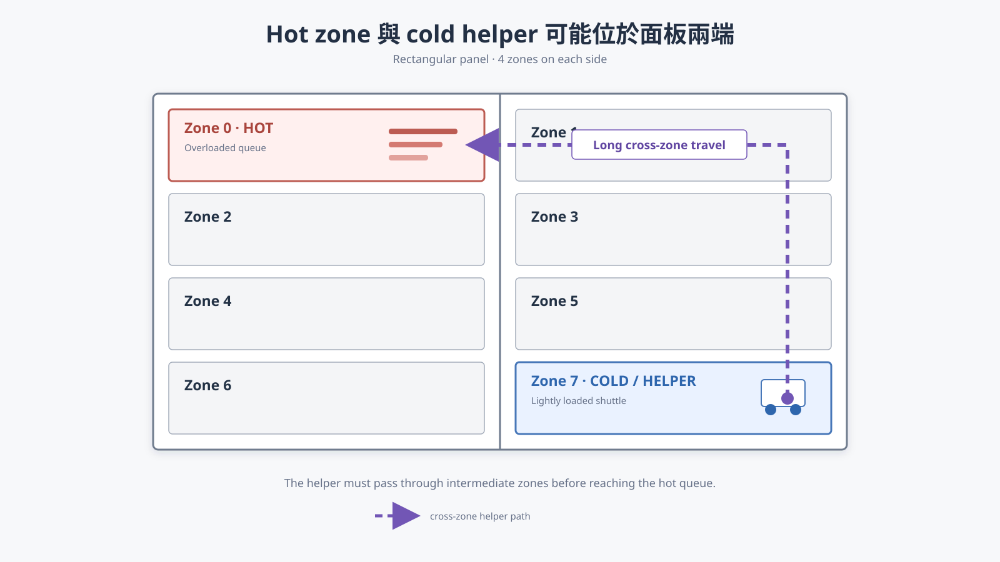

# Static-Zone Hotspots and Locality-Aware Work Stealing

## 一句話定義

本研究探討 8-zone glass storage library 在 hotspot workload 下的固定 ownership 失衡，以及如何利用 locality-aware、bounded work stealing 協助 hot zone，同時避免遠距 shuttle 穿越其他 zones 所造成的額外移動與干擾。

## 目前結論



[圖解與逐步說明](project-silica-work-stealing-explainer.md)

Static zoning 本身是合理設計：它限制每台 shuttle 的正常活動範圍，使 traffic management、reader ingress 與 congestion 更容易控制。問題出現在 active requests 暫時集中於少數 zones 時：hot zone 持續排隊，其他 zones 卻可能提早 idle。

Microsoft Project Silica 使用 work stealing 作為 load imbalance 的 fallback。Lightly loaded partition 的 shuttle 可以暫時離開自己的 partition，到 overloaded partition 取 platter。這能恢復部分資源彈性，但也重新引入 static partition 原本想避免的跨區移動與 congestion exposure。

目前最重要的 insight 是：

> Coldest zone 不一定是最適合的 helper zone。是否值得 stealing，還取決於 helper 與 hot zone 的距離、途中 zones 的負載、額外 platter travel，以及同時進入 hot zone 的 helper 數量。

## 研究範圍

第一階段固定使用 8 個 static zones，不改變 zone 數量或基本硬體配置：

- 8 個固定 physical service zones。
- 每個 zone 一台 shuttle 與一個 local reader resource。
- Glass 的 physical location 固定，讀取後返回原位。
- 正常情況下 shuttle 只服務自己的 zone。
- Hotspot 先設定在單一 zone，例如 Zone 0。
- 暫時不使用 Zipf distribution。
- 暫時不研究完整 dynamic zoning 或任意 global sharing。

這個範圍先回答一個簡單問題：static-zone system 遇到 hotspot 時，應該如何借用其他 zones 的 idle resources？

## Source-backed facts

根據 [Project Silica SOSP 2023](../references/ProjectSilica-SOSP23.pdf)：

- Panel 被分成與 active shuttles 數量相同的 rectangular logical partitions。
- 每個 partition 包含一台 shuttle，並至少包含一個 read-drive slot。
- 正常情況下 shuttle 不離開自己的 partition，以降低 traffic-management complexity 和 reader congestion。
- Controller 監控各 partitions 的待讀 data volume。
- 最忙與最閒 partition 的 load difference 超過 threshold 時，可以觸發 work stealing。
- Lightly loaded partition 的 shuttle 暫時進入 overloaded partition 取 platter。
- 跨 partition movement 使用 shortest-path routing，但論文明確指出這可能造成額外 congestion。
- 論文的 skew experiment 顯示 work stealing 能降低 tail completion time，但 tail travel time 同時增加。

論文沒有完整說明 stolen platter 的選擇方式、helper reader assignment、同時允許的 helper 數量，以及詳細 path reservation。這些不能直接當成 Microsoft 已實作的確定行為，必須列為我們 baseline 的明確假設。

## 研究故事

整體故事由淺入深：

```text
Static zones simplify shuttle traffic
        ↓
Balanced workload 下，各 zones 可以平行工作
        ↓
Single-zone hotspot 使固定 owner 成為 bottleneck
        ↓
其他 zones 有 idle shuttle-reader resources
        ↓
Work stealing 借用 cold-zone shuttle 協助 hot zone
        ↓
遠距 helper 必須跨越其他 zones
        ↓
額外 travel、intermediate-zone interference、hot-zone congestion
        ↓
需要 locality-aware、bounded assistance
```

這個故事不主張 work stealing 無效。相反地，work stealing 是必要且合理的 baseline。我們要研究的是：在獲得 load-balancing benefit 的同時，如何控制跨區 assistance 的成本。

## 8-zone hotspot example

假設 Zone 0 為 hot zone，而 Zone 7 最空：

```text
HOT                                             COLD
Zone 0 | Zone 1 | Zone 2 | Zone 3 | ... | Zone 7
██████                                      helper
```

一次遠距 stealing 可能包含：

1. Shuttle 7 從 Zone 7 空車移動到 Zone 0。
2. Shuttle 7 經過中間 zones，traffic manager 必須協調路徑與 conflict。
3. Shuttle 7 在 Zone 0 取出一片 glass。
4. Glass 被送往可用 reader；reader assignment 是 baseline 必須定義的假設。
5. 讀取完成後，glass 返回原本 storage location。
6. Helper shuttle 回到自己的正常服務區域，或繼續執行另一個 stolen task。

即使 Zone 7 比 Zone 1 更空，Shuttle 7 的遠距 repositioning 和 route interference 仍可能使它不如鄰近 helper。這表示 donor selection 不能只按照 queue load 排序。

## Work-stealing costs

### 1. Helper repositioning

Helper 在開始任何 productive fetch 前，必須先到達 hot zone。如果 hot queue 很短，helper 可能尚未抵達，local shuttle 就已經完成大部分工作。

### 2. Intermediate-zone interference

跨區 shuttle 不會無控制地闖入其他 zones；traffic manager 仍必須避免碰撞。但 helper 可能迫使途中 shuttles 等待、減速、繞路或重新安排優先權。協助 hot zone 的收益可能因此轉化成其他 zones 的 latency。

### 3. Hot-zone ingress congestion

多台 helpers 同時進入 hot zone 時，可能競爭 rails、storage slots、pick locations 或 reader ingress。Helper 數量增加後，收益可能出現 diminishing returns。

### 4. Platter return and helper recovery

Glass 必須返回固定 storage location。若 helper 服務完成後還要回到自己的 zone，完整成本不只包含單程前往 hotspot。

## 核心研究問題

> How should a static-zone glass library assist a hot zone without letting long-distance work stealing disrupt otherwise healthy zones?

中文表述：

> 在 static-zone glass library 中，如何利用 idle shuttle 協助 hot zone，同時避免遠距跨區移動干擾其他正常工作的 zones？

可用下列簡化關係思考一次 stealing decision：

```text
Stealing benefit
= hot-zone completion-time reduction

Stealing cost
= helper repositioning
 + stolen-task travel
 + platter return
 + intermediate-zone interference
 + hot-zone congestion
```

只有預期 benefit 大於 cost 時，才值得執行 stealing。

## Motivation experiments

### Experiment 0: Static hotspot baseline

目的：先確認 8-zone strict static system 在 hotspot 下確實出現 hot queue 與 idle resources 並存。

Workloads：

- Balanced：每個 zone 約 12.5% demand。
- Moderate hotspot：Zone 0 約 50% demand。
- Strong hotspot：Zone 0 約 80% demand。

Primary metrics：batch completion time、per-zone completion time、shuttle utilization、idle zone-time while Zone 0 still has backlog。

### Experiment 1: Helper distance

固定 Zone 0 hotspot 與相同 task list，分別由 Zone 1、Zone 2、Zone 4、Zone 7 提供一台 helper。

控制條件：hotspot intensity、helper count、task list、reader/shuttle 數量與硬體參數完全相同。

觀察：hot-zone completion time、helper repositioning time、crossed-zone count、total shuttle travel、batch completion time。

Hypothesis：helper 越遠，load-balancing benefit 中越大比例會被額外移動成本抵銷；nearest helper 不一定最空，但可能有最高 net benefit。

### Experiment 2: Intermediate-zone load

固定 hot zone、helper zone 與兩者距離，只改變途中 zones 的負載：idle、moderate、busy。

觀察：intermediate-zone request latency、helper conflict waiting、detour/stop time、batch completion time。

Hypothesis：相同距離不代表相同 stealing cost；路徑穿過 busy zones 時，helper 會對其他 zones 產生更大的 externality。

### Experiment 3: Helper count

固定 hotspot，依序使用 0、1、2、4、7 helpers。

觀察：hot-zone completion time、cross-zone travel、hot-zone ingress waiting、conflict count 與 marginal improvement per helper。

Hypothesis：初期增加 helpers 能縮短 hot queue，但過多 helpers 會因共享路徑與 reader ingress 競爭而出現 diminishing returns。

## Baselines

第一階段至少比較：

| Policy | 角色 |
| --- | --- |
| Strict static zones | 不跨區，顯示 hotspot imbalance |
| Microsoft-style load-only work stealing | 根據 partition load 選擇 cold helper |
| Nearest-idle helper | 單純 locality-aware baseline |
| Locality-aware bounded assistance | 後續 proposed direction |

Global shared pool 可在後期作為 flexibility upper bound，但不需要放進最初的 motivation experiment。

## Proposed direction

第一版不直接實作完整 dynamic zoning，而從簡單的 locality-aware bounded assistance 開始：

- 優先考慮鄰近 hot zone 的 idle或 lightly loaded helpers。
- 限制 helper 最多跨越的 zones。
- 限制同時進入 hot zone 的 helper 數量。
- 只有預期 completion-time reduction 大於額外 travel/interference 時才 stealing。
- Epoch 內保持 helper assignment 穩定，避免頻繁切換。

若這個簡單方法能形成穩定收益，再逐步發展為 temporary service-region adjustment 或 request-centric virtual zones。

## 已有證據

目前已完成三組互補實驗。

第一組 RQ1 natural-trace characterization 使用完整一小時 LUN trace，共 1,399,055 筆 read，保持 timestamp order，沒有人工重排 hotspot。由於 trace 只有 LBA、沒有真實 Silica platter placement，實驗明確分成三個 randomized-hash placements 與一個 contiguous-LBA sensitivity bound。

- [Natural skew versus observation scale](../../results/natural-trace-skew-rq1/figures/fig1_natural_skew_vs_window.png)
- [Logical requests versus post-merge work](../../results/natural-trace-skew-rq1/figures/fig2_logical_vs_post_merge_work.png)
- [Natural zone activity heatmap](../../results/natural-trace-skew-rq1/figures/fig3_natural_zone_activity_heatmap.png)
- [Placement sensitivity](../../results/natural-trace-skew-rq1/figures/fig5_placement_sensitivity.png)
- [RQ1 experiment contract and interpretation](../../results/natural-trace-skew-rq1/RQ1_NATURAL_TRACE_CHARACTERIZATION.md)

RQ1 的主要結果是：

- Randomized placement 下，100-request windows 的 P95 busiest-zone post-merge work share 為 47.1%，表示短尺度 natural burst 確實存在。
- 同一假設下，5,000-request windows 降至 17.7%，60-second windows 為 14.8%；兩者都沒有超過 25% threshold，因此不能宣稱 persistent severe imbalance。
- Contiguous-LBA sensitivity 在 5,000-request windows 仍達 55.6%，60-second windows 達 38.2%，表示 access skew 是否轉化為 zone skew，高度依賴 data placement。
- 64 組 placement/window 守恆檢查全部通過；32 個 sampled windows 對完整 static-zone simulator 的 work-share 平均絕對誤差為 0.21 percentage points，最大 1.97 points。

因此，RQ1 支持的故事不是「static zones 在任何 workload 都會嚴重失衡」，而是兩個條件式問題：randomized placement 下的短時間 burst adaptation，以及 placement 與 access locality 相關時的持續失衡。Contiguous-LBA 結果只能作 sensitivity evidence，不能當成 Microsoft 實際 mapping。

第二組 strict static paired active-zone concentration experiment 使用相同 640 個 unique glass tasks、相同 local coordinates 與幾乎相同 total productive work，只改 active tasks 屬於 1、2、4 或 8 個固定 zones。

- [Active-zone concentration figure](../../results/static-baseline-study/figures/fig8_active_zone_concentration.png)
- [Fixed-zone activity timeline](../../results/static-baseline-study/figures/fig9_fixed_zone_activity_timeline.png)
- [Static baseline analysis](../../results/static-baseline-study/STATIC_BASELINE_BOTTLENECK_ANALYSIS.md)

第三組 focused work-stealing experiment 使用 8 zones、640 個 unique glass tasks 與 5 個 seeds，控制 Zone 0 demand share 為 12.5%、50% 或 80%，並在 80% hotspot 下固定只加入一台 Zone 1、2、4 或 7 helper。

- [Hotspot motivation figure](../../results/static-zone-work-stealing-study/figures/fig1_static_hotspot_motivation.png)
- [Per-zone activity timeline](../../results/static-zone-work-stealing-study/figures/fig2_static_zone_timeline.png)
- [Helper-distance comparison](../../results/static-zone-work-stealing-study/figures/fig3_helper_distance.png)
- [Benefit-cost tradeoff](../../results/static-zone-work-stealing-study/figures/fig4_work_stealing_tradeoff.png)
- [Full result interpretation](../../results/static-zone-work-stealing-study/STATIC_ZONE_WORK_STEALING_MOTIVATION.md)

主要結果如下：

- Balanced strict static workload 平均 0.74 h 完成；80% single-zone hotspot 平均 4.59 h，增加為 6.21x，並有 84.4% zone-time capacity 在 panel drain 前處於 idle。
- 鄰近 Zone 2 helper 平均將 80% hotspot makespan 降低 40.6%，但增加 0.68 h aggregate shuttle travel。
- 遠距 Zone 7 helper 只降低 27.4% makespan，卻增加 1.91 h aggregate shuttle travel。

這些結果支持兩個 observation：strict fixed ownership 會 strand capacity；work stealing 能恢復平行度，但 helper locality 會顯著影響 direct movement cost 與 net completion benefit。它們尚未證明 intermediate-zone interference，也尚未證明 proposed method 優於 Microsoft-style baseline。

## Evidence boundaries and implementation requirements

- 現有 simulator 已實作 collision-free single-helper work stealing baseline。
- Helper 先完成自己的 local queue，使用自己的 local reader 服務 stolen platter，並將 glass 返回原始 slot。
- 現有模型有計算跨區移動時間，但沒有 route conflict 與 collision waiting，因此不能用它直接宣稱 intermediate-zone congestion 或 interference 改善。
- 至少需要 coarse route-conflict model，才能研究 intermediate-zone interference。
- 所有 policies 必須 replay 相同的 merged glass-task list。
- 如果 Microsoft-style work stealing 已能以低 travel cost 接近最佳 completion time，則 proposed method 的研究空間有限。

## 下一步

1. 先用 RQ1 的 natural mapped task windows replay strict-static 與 work-stealing，重點放在 100-1,000 requests 或 1-15 seconds 的短控制週期。
2. Randomized 與 contiguous placement 必須分開報告；在取得真實 Silica mapping 前，不把 contiguous sensitivity 當 primary result。
3. 保留目前 single-helper collision-free 結果作為 direct-movement lower bound。
4. 加入 intermediate-zone load 和 coarse route-conflict waiting，確認遠距 helper 對正常 zones 的 externality。
5. 做 helper-count sweep，最後比較 Microsoft-style load-only donor selection、nearest-idle 與 locality-aware bounded assistance。

## 相關筆記

- [Archived request-centric virtual zones](../../archive/research/request-centric-virtual-zones.md)：較廣的早期方向，目前不作為主線。
- [Archived motivation presentation](../../archive/research/presentations/from-batch-skew-to-adaptive-zones-en.pdf)：基於 controlled batch skew 的舊版簡報。
- [Project Silica SOSP 2023](../references/ProjectSilica-SOSP23.pdf)：static partition 與 work stealing 的主要來源。
